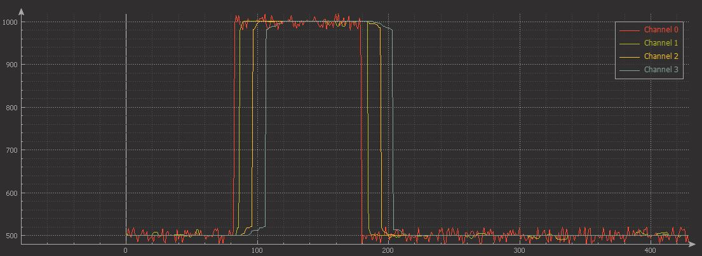
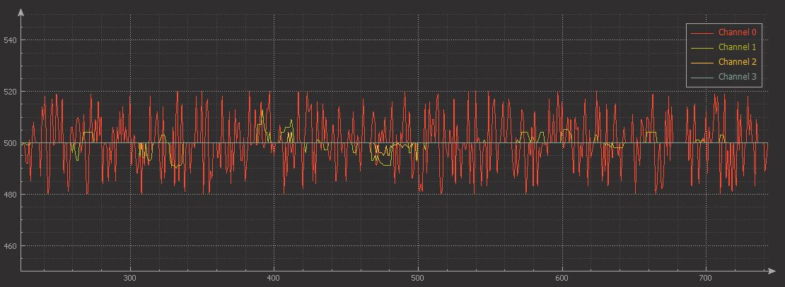

# Moving-median-filter

Moving median filter based on FIFO buffer.

[Library files](https://github.com/binarymaker/moving-median-filter/tree/master/sw-moving-median/User-Library/moving-median-library)

# Concept Block

```
                           input
                             +
                             |
                          +--+--+
                          | S/H | <-----------------+ sampling time
                          +--+--+
                             |
                             v
          +------------------+--------------------+
index +-->+                 DEMUX                 |
          +----+------+------+----------------+---+
               |      |      |                |
            +--+-+ +--+-+ +--+-+           +--+-+
            | B0 | | B1 | | B3 | . . . . . | Bn |   <+ buffer
            +-+--+ +-+--+ +-+--+           +-+--+      n is size+1
              |      |      |                |
          +---+------+------+----------------+----+
          |                 SORT                  |
          +----+------+------+----------------+---+
               |      |      |                |
            +--+-+ +--+-+ +--+-+           +--+-+
            | S0 | | S1 | | S2 | . . . . . | Sn |    <+ sorted list
            +-+--+ +-+--+ +-+--+           +-+--+
              |      |      |                |
              +------+------++---------------+
                             |
                    +--------+--------+
                    |  Fill index / 2 |               <+ list
                    +--------+--------+                  med value
                             |
                             v
                          filtered

```

# Code usage

```
/* Include library */
#include "moving-median.h"

/* Filter objects */
movingMedian_t med_filter;
movingMedian_t med_filter_2;

void main()
{
   /* Initialization of filters */
   moving_median_create(&med_filter, 11, 100);   /* filter size 11, sample time 100ms */
   moving_median_create(&med_filter_2, 29, 150); /* filter size 29, sample time 150ms */

   /* wait for 1 maximum sample time */
   delay(150);

   while(1)
   {
      signal = signal_source();  /* signal source function may ADC, Capture count, sensor data*/

      /* Filter process
      * 
      * call this function maximum passible short time
      */
      moving_median_filter(&med_filter, signal);
      moving_median_filter(&med_filter_2, signal);

      process_or_print = med_filter.filtered;
      process_or_print = med_filter_2.filtered;
   }
}

```

# Filter images

   + channel 0 - signal + noise (+/- 20)
   + channel 1 - filter size 9, sample time 100ms 
   + channel 2 - filter size 29, sample time 100ms 
   + channel 3 - filter size 49, sample time 100ms 



